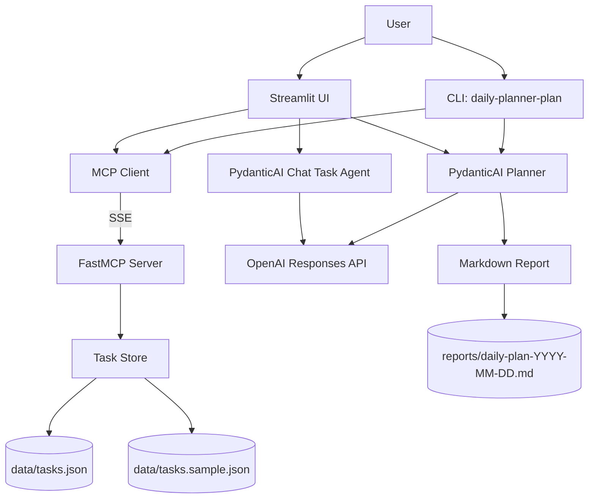
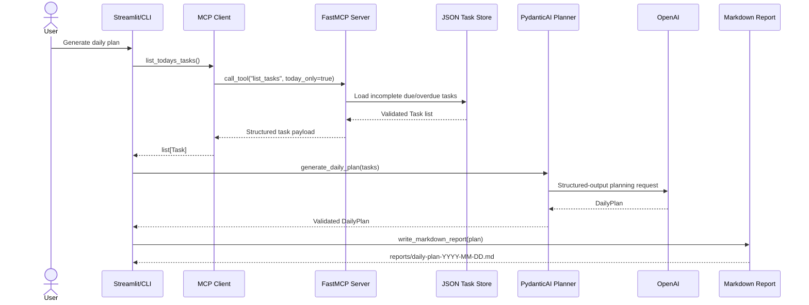
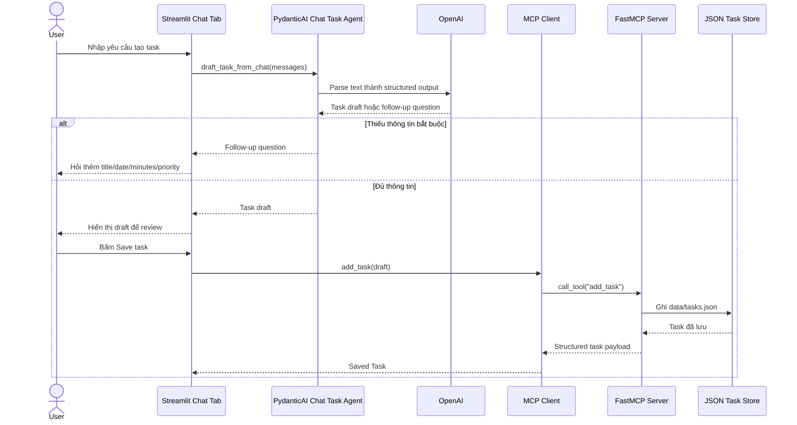

# Daily Planner Agent

Daily Planner Agent là demo Python cho một trợ lý lập kế hoạch công việc trong ngày. Project kết hợp task store cục bộ, MCP server, MCP client, PydanticAI và OpenAI để biến danh sách việc cần làm thành lịch làm việc dạng markdown.

Ứng dụng có hai cách dùng chính:

- Streamlit UI để quản lý task và tạo kế hoạch hằng ngày.
- CLI để hoàn thành một task tùy chọn rồi sinh báo cáo markdown.

## Tính Năng Chính

- Lưu task trong JSON tại `data/tasks.json`.
- Có dữ liệu mẫu tại `data/tasks.sample.json` và hỗ trợ reset nhanh.
- Validate dữ liệu bằng Pydantic cho task, time block và daily plan.
- FastMCP SSE server expose các tool: `list_tasks`, `add_task`, `complete_task`, `reset_tasks`.
- MCP client dùng chung cho Streamlit UI và CLI.
- Chat agent trong Streamlit tạo bản nháp task từ text tự nhiên hoặc hỏi lại khi thiếu thông tin. Agent không ghi task trực tiếp; task chỉ được lưu qua MCP sau khi user xác nhận.
- PydanticAI gọi OpenAI Responses model để sinh lịch làm việc có cấu trúc.
- Xuất báo cáo markdown vào `reports/daily-plan-YYYY-MM-DD.md`.
- Test suite bằng `pytest`.

## Kiến Trúc



Luồng xử lý khi tạo kế hoạch:



Luồng tạo task bằng Chat:



Điểm quan trọng: Chat agent chỉ quyết định nội dung draft hoặc câu hỏi follow-up. Quyền ghi task nằm ở Streamlit UI sau hành động `Save task`, và UI ghi thông qua MCP client.

## Cấu Trúc Thư Mục

```text
.
├── data/
│   ├── tasks.json             # Task store đang sử dụng
│   └── tasks.sample.json      # Dữ liệu mẫu để reset
├── reports/                   # Báo cáo markdown được sinh ra
├── src/daily_planner_agent/
│   ├── chat_agent.py          # Agent tạo bản nháp task từ chat
│   ├── cli.py                 # Entry point CLI
│   ├── config.py              # Đọc .env và khai báo path mặc định
│   ├── mcp_client.py          # MCP SSE client
│   ├── mcp_server.py          # FastMCP server và tool definitions
│   ├── models.py              # Pydantic models
│   ├── planner.py             # PydanticAI/OpenAI planner
│   ├── reporting.py           # Render/write markdown report
│   ├── store.py               # JSON task store
│   └── streamlit_app.py       # Streamlit UI
├── tests/                     # Unit tests
├── .env.example               # Mẫu biến môi trường
├── pyproject.toml             # Dependencies và script entry points
└── README.md
```

## Yêu Cầu

- Python `>=3.12`
- `uv`
- OpenAI API key nếu muốn sinh kế hoạch bằng LLM

## Cài Đặt

Clone hoặc mở project, sau đó cài dependencies:

```powershell
uv sync
```

Tạo file `.env` từ `.env.example`:

```powershell
Copy-Item .env.example .env
```

Cấu hình các biến môi trường:

```env
OPENAI_API_KEY=
OPENAI_MODEL=gpt-5-nano
MCP_SERVER_URL=http://localhost:8000/sse
```

Ý nghĩa:

| Biến | Bắt buộc | Mặc định | Mô tả |
|---|---:|---|---|
| `OPENAI_API_KEY` | Có, khi dùng Planner hoặc Chat agent | Không có | API key dùng bởi PydanticAI/OpenAI planner và chat task agent. |
| `OPENAI_MODEL` | Không | `gpt-5-nano` | Model OpenAI dùng để sinh `DailyPlan` và task draft. |
| `MCP_SERVER_URL` | Không | `http://localhost:8000/sse` | SSE endpoint để UI/CLI gọi MCP server. |

Nếu thiếu `OPENAI_API_KEY`, phần quản lý task vẫn có thể chạy, nhưng Planner và Chat agent sẽ báo lỗi trước khi gọi LLM.

## Chạy MCP Server

MCP server phải chạy trước khi dùng Streamlit UI hoặc CLI, vì cả hai đều gọi task store qua MCP.

```powershell
uv run daily-planner-mcp
```

Endpoint mặc định:

```text
http://localhost:8000/sse
```

Nếu đổi `MCP_SERVER_URL`, server sẽ đọc host, port và path từ biến này.

## Chạy Streamlit UI

Mở terminal thứ hai và chạy:

```powershell
uv run streamlit run src/daily_planner_agent/streamlit_app.py
```

UI có ba tab:

- `Tasks`: xem task, thêm task, hoàn thành task, reset dữ liệu mẫu.
- `Planner`: sinh kế hoạch hằng ngày, preview markdown và tải file report.
- `Chat`: nhập yêu cầu bằng ngôn ngữ tự nhiên để agent tạo bản nháp task. Nếu thiếu `title`, `due_date`, `estimated_minutes` hoặc `priority`, agent sẽ hỏi lại. Task chỉ được lưu sau khi bạn bấm `Save task`.

Ví dụ Chat có đủ thông tin:

```text
Tạo task chuẩn bị slide demo cho ngày 2026-06-12, mất 45 phút, priority high.
```

Ví dụ Chat thiếu thông tin:

```text
Nhắc tôi chuẩn bị slide demo.
```

Trong trường hợp thiếu thông tin, agent sẽ hỏi lại thay vì tự chọn ngày, thời lượng hoặc priority mặc định.

## Chạy CLI

Sinh kế hoạch trong ngày:

```powershell
uv run daily-planner-plan
```

Hoàn thành một task qua MCP trước khi sinh kế hoạch:

```powershell
uv run daily-planner-plan --complete today-medium
```

Kết quả được ghi vào:

```text
reports/daily-plan-YYYY-MM-DD.md
```

CLI trả mã lỗi rõ ràng cho các lỗi phổ biến:

- `2`: thiếu `OPENAI_API_KEY`.
- `3`: không kết nối được MCP server hoặc MCP trả payload không hợp lệ.

## Kiểm Thử

Chạy toàn bộ test suite:

```powershell
uv run pytest
```

Kiểm tra MCP client thủ công:

```powershell
uv run daily-planner-mcp
```

Trong terminal khác:

```powershell
uv run python -m daily_planner_agent.mcp_client_check
```

Script này list tool, thêm task, hoàn thành task rồi reset `data/tasks.json` từ `data/tasks.sample.json`.

## Dữ Liệu Task

Task có schema:

```json
{
  "id": "today-medium",
  "title": "Review planner requirements",
  "description": "Read the locked decisions and verify Phase 1 stays inside scope.",
  "due_date": "2026-06-10",
  "estimated_minutes": 45,
  "priority": "medium",
  "completed": false
}
```

Các priority hợp lệ:

- `low`
- `medium`
- `high`

Planner chỉ lấy các task chưa hoàn thành có `due_date` nhỏ hơn hoặc bằng ngày hiện tại. Các task chưa thể xếp trong khung 09:00-17:00, hoặc bị giới hạn bởi giờ nghỉ 12:00-13:00, sẽ nằm trong `unscheduled_overflow`.

## Reset Dữ Liệu Mẫu

Qua Streamlit UI, dùng nút `Reset sample data` trong tab `Tasks`.

Hoặc chạy trực tiếp:

```powershell
uv run python -c "from daily_planner_agent.store import reset_tasks; print(len(reset_tasks()))"
```

## Troubleshooting

### Không kết nối được MCP server

Đảm bảo MCP server đang chạy:

```powershell
uv run daily-planner-mcp
```

Kiểm tra `MCP_SERVER_URL` trong `.env` trùng với endpoint server đang lắng nghe.

### Planner báo thiếu OpenAI API key

Thêm API key vào `.env`:

```env
OPENAI_API_KEY=your_api_key_here
```

Sau đó chạy lại CLI hoặc bấm lại `Generate daily plan` trong Streamlit.

### Task store bị lỗi JSON hoặc schema

Reset lại dữ liệu mẫu:

```powershell
uv run python -c "from daily_planner_agent.store import reset_tasks; reset_tasks()"
```

### Port 8000 đã được dùng

Đổi `MCP_SERVER_URL` trong `.env`, ví dụ:

```env
MCP_SERVER_URL=http://localhost:8010/sse
```

Sau đó khởi động lại MCP server và ứng dụng đang dùng MCP client.
