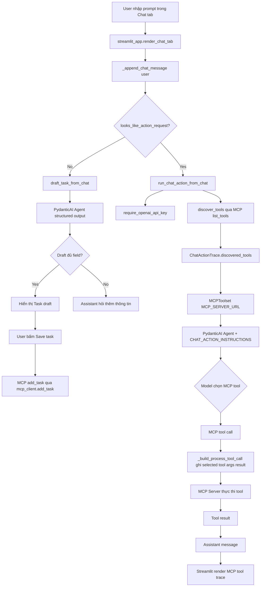
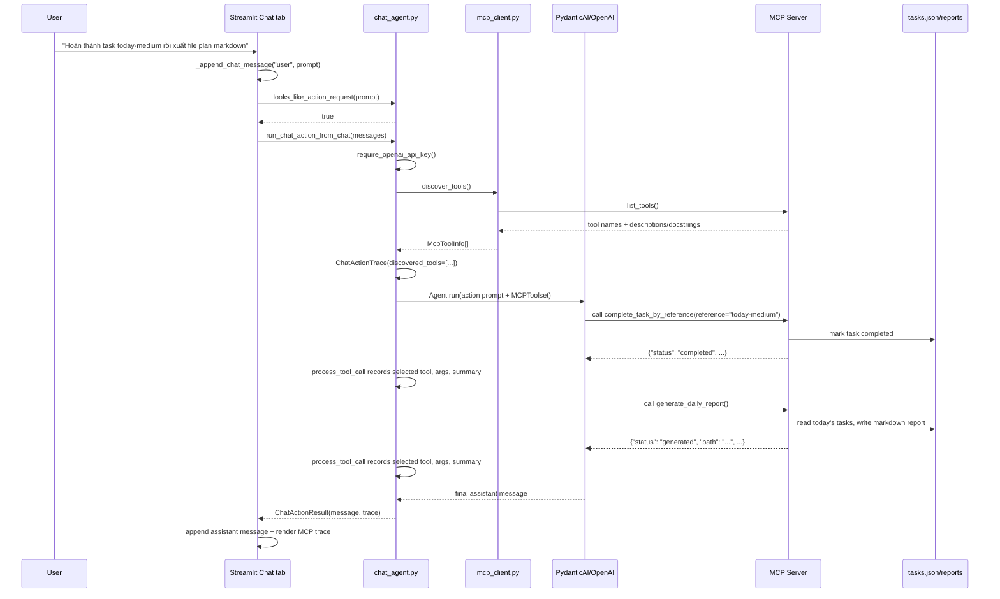
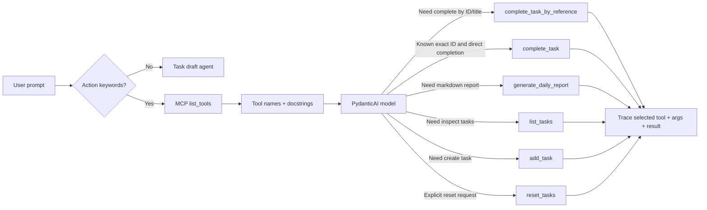
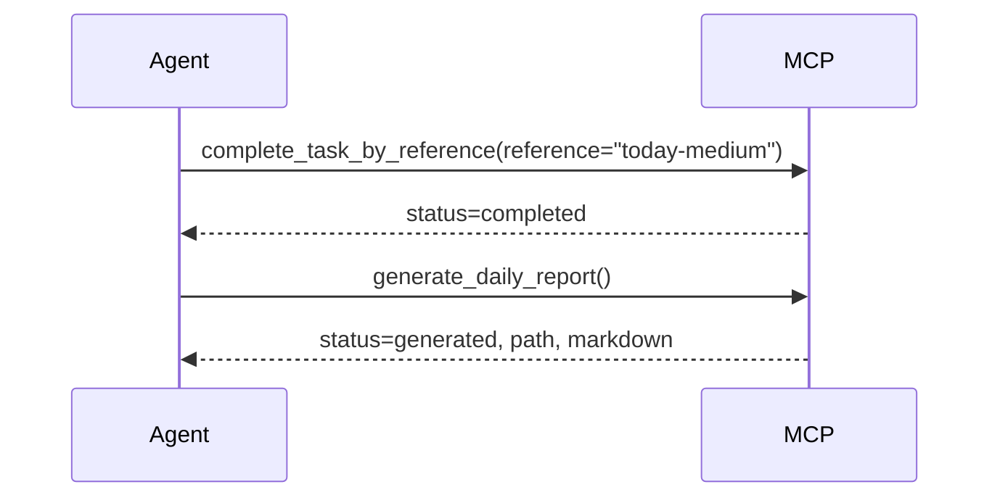

# Chat Agent MCP Tool Discovery Workflow

Tài liệu này mô tả luồng Chat agent nhận yêu cầu từ Streamlit, khám phá MCP tools, để model chọn tool phù hợp, thực thi tool, rồi hiển thị trace lại cho người dùng.

## Mục tiêu

Chat agent có hai loại luồng:

- **Task draft flow:** user muốn tạo task mới bằng ngôn ngữ tự nhiên. Agent chỉ tạo bản nháp hoặc hỏi thêm thông tin. Task chỉ được lưu khi user bấm `Save task`.
- **MCP action flow:** user muốn hoàn thành task hoặc xuất report markdown. Agent kết nối MCP server, discover tools, chọn tool phù hợp từ danh sách tools, thực thi ngay nếu lệnh rõ, và ghi trace.

## Sơ Đồ Tổng Quan



## Sequence Diagram



## Code Path Theo Từng Bước

### 1. User nhập prompt trong Chat tab

Điểm vào là `render_chat_tab()` trong `src/daily_planner_agent/streamlit_app.py`.

```python
if prompt := st.chat_input("Describe a task to create"):
    _append_chat_message("user", prompt)
    if looks_like_action_request(prompt):
        _handle_chat_action()
        st.rerun()
```

Ý nghĩa:

- Prompt luôn được lưu vào `CHAT_MESSAGES_KEY`.
- `looks_like_action_request(prompt)` quyết định đây là action command hay task draft.
- Nếu là action command, UI gọi `_handle_chat_action()` và không đi vào luồng draft task.

### 2. Phân loại action command

Hàm `looks_like_action_request()` nằm trong `src/daily_planner_agent/chat_agent.py`.

```python
def looks_like_action_request(content: str) -> bool:
    normalized = content.casefold()
    return any(keyword in normalized for keyword in ACTION_KEYWORDS)
```

`ACTION_KEYWORDS` gồm các từ như:

- `complete`, `done`, `finish`
- `hoàn thành`, `xong`
- `export`, `report`, `markdown`
- `xuất`, `báo cáo`, `kế hoạch`

Mục tiêu của bước này chỉ là routing UI. Việc chọn tool nào không diễn ra ở đây.

### 3. Bắt đầu action flow

`_handle_chat_action()` gọi `run_chat_action_from_chat()`.

```python
result = run_async(run_chat_action_from_chat(_chat_messages()))
```

Nếu thành công:

```python
_append_chat_message("assistant", result.message)
_append_chat_trace(result.trace)
```

Nếu thiếu API key hoặc MCP server lỗi, lỗi được append vào chat như assistant message.

### 4. Agent kiểm tra OpenAI settings và MCP settings

Trong `run_chat_action_from_chat()`:

```python
settings = require_openai_api_key()
mcp_settings = get_mcp_server_settings()
```

Ý nghĩa:

- `require_openai_api_key()` đảm bảo agent không gọi model khi thiếu `OPENAI_API_KEY`.
- `get_mcp_server_settings()` lấy `MCP_SERVER_URL`, mặc định là `http://localhost:8000/sse`.

### 5. Discover MCP tools trước khi agent chạy

```python
discovered = await discover_tools()
trace = ChatActionTrace(discovered_tools=[tool.name for tool in discovered])
```

`discover_tools()` nằm trong `src/daily_planner_agent/mcp_client.py`.

```python
async def discover_tools() -> list[McpToolInfo]:
    async with task_session() as session:
        result = await session.list_tools()
    return [
        McpToolInfo(
            name=tool.name,
            description=tool.description or "",
        )
        for tool in result.tools
    ]
```

Ý nghĩa:

- App mở MCP session qua SSE.
- Gọi `session.list_tools()`.
- Lấy tool name và description từ MCP server.
- Lưu danh sách tool vào `ChatActionTrace.discovered_tools`.

Đây là bằng chứng UI có thể hiển thị agent đã khám phá được tools nào.

### 6. MCP tool descriptions đến từ docstring

MCP tools được khai báo trong `src/daily_planner_agent/mcp_server.py` bằng `@mcp.tool()`.

Ví dụ:

```python
@mcp.tool()
def complete_task_by_reference(reference: str) -> dict[str, Any]:
    """Complete a task by exact task ID or by unique incomplete task title.

    Use this as the preferred completion tool for natural-language chat
    requests because users may mention either a task ID or a task title.
    ...
    """
    return complete_task_by_reference_result(reference)
```

Tool docstring này trở thành description trong MCP `list_tools()`. Agent dùng description để phân biệt:

- Khi nào dùng `complete_task_by_reference`.
- Khi nào dùng `generate_daily_report`.
- Tool nào có side effect.
- Return shape có status gì.

Các tool hiện có:

| Tool | Khi nên chọn |
|---|---|
| `list_tasks` | Xem task, tìm task ID, kiểm tra title unique, gather context |
| `add_task` | Tạo task mới khi đủ field |
| `complete_task` | Hoàn thành bằng exact task ID |
| `complete_task_by_reference` | Preferred tool cho natural-language completion bằng task ID hoặc title |
| `generate_daily_report` | Xuất/generate/write daily plan markdown report |
| `reset_tasks` | Chỉ dùng khi user yêu cầu reset sample data |

### 7. Agent được cấp MCPToolset, không hardcode tool choice

Sau discovery, code tạo `MCPToolset`.

```python
toolset = MCPToolset(
    mcp_settings.url,
    process_tool_call=_build_process_tool_call(trace),
    cache_tools=False,
)
```

Sau đó tạo PydanticAI agent:

```python
agent = Agent(
    model,
    output_type=ChatActionAgentOutput,
    instructions=CHAT_ACTION_INSTRUCTIONS,
    toolsets=[toolset],
    retries=2,
)
```

Điểm quan trọng:

- Chat app không gọi trực tiếp `complete_task_by_reference()` hoặc `generate_daily_report()`.
- Chat app đưa MCP server URL cho `MCPToolset`.
- Model nhìn thấy MCP tools từ server và tự chọn tool phù hợp.
- `cache_tools=False` giúp toolset lấy tool metadata mới thay vì giữ cache cũ trong runtime dài.

### 8. Prompt action đưa context và danh sách discovered tools cho model

```python
result = await agent.run(
    _build_action_prompt(messages, today or date.today(), trace.discovered_tools)
)
```

Prompt được build như sau:

```python
def _build_action_prompt(messages, today, discovered_tools):
    lines = [
        f"Current local date: {today.isoformat()}",
        "Discovered MCP tools:",
        *[f"- {tool}" for tool in discovered_tools],
        "",
        "Conversation:",
    ]
    ...
    lines.extend(
        [
            "",
            "Use the MCP tools to satisfy the latest user action request.",
            "If no discovered tool can satisfy the request, say what is missing.",
        ]
    )
```

Ý nghĩa:

- Model thấy ngày hiện tại.
- Model thấy hội thoại user/assistant.
- Model thấy danh sách tool đã discover.
- Tool descriptions chi tiết được MCPToolset cung cấp cho model.

### 9. Model chọn và gọi MCP tool

Khi model quyết định cần complete task:

```text
complete_task_by_reference(reference="today-medium")
```

Hoặc nếu user yêu cầu export report:

```text
generate_daily_report()
```

Nếu user yêu cầu nhiều action trong một câu, model có thể gọi nhiều tool theo thứ tự:

1. `complete_task_by_reference(reference="...")`
2. `generate_daily_report()`

### 10. Trace ghi lại selected tool, arguments, result summary

`process_tool_call` được truyền vào `MCPToolset`.

```python
def _build_process_tool_call(trace: ChatActionTrace):
    async def process_tool_call(_ctx, call_tool, tool_name, arguments):
        result = await call_tool(tool_name, arguments)
        trace.calls.append(
            ChatToolCallTrace(
                tool_name=tool_name,
                arguments=dict(arguments),
                result_summary=summarize_tool_result(result),
            )
        )
        return result
```

Mỗi lần model gọi tool:

- `tool_name` được lưu vào trace.
- `arguments` được lưu vào trace.
- Tool result được tóm tắt bằng `summarize_tool_result()`.
- Result vẫn được trả lại cho model để model tiếp tục hoặc tạo final answer.

### 11. MCP server thực thi tool hoàn thành task

`complete_task_by_reference_result()` xử lý reference.

```python
tasks = store_list_tasks(include_completed=True)
for task in tasks:
    if task.id == normalized:
        completed = store_complete_task(task.id)
        return {
            "status": "completed",
            "message": f"Completed task {completed.id}.",
            "task": task_to_dict(completed),
        }
```

Nếu không match ID, tool match title case-insensitive trên các task chưa hoàn thành.

```python
title_matches = [
    task
    for task in tasks
    if not task.completed and task.title.casefold() == normalized.casefold()
]
```

Kết quả:

- 1 match: complete task.
- Nhiều match: trả `status="needs_clarification"` và danh sách matches.
- 0 match: trả `status="not_found"`.

Tool không mutate dữ liệu nếu title mơ hồ hoặc không tìm thấy.

### 12. MCP server thực thi tool tạo report markdown

`generate_daily_report_result()`:

```python
tasks = list_todays_tasks()
plan = await generate_daily_plan(tasks)
path = write_markdown_report(plan)
markdown = render_markdown_report(plan)
```

Luồng này:

1. Lấy incomplete tasks due hoặc overdue.
2. Gọi planner LLM để tạo `DailyPlan`.
3. Ghi markdown vào `reports/daily-plan-YYYY-MM-DD.md`.
4. Trả `path`, `markdown`, `task_count`, `plan_date`.

### 13. Streamlit hiển thị trace

Trace được lưu trong session state:

```python
def _append_chat_trace(trace: ChatActionTrace) -> None:
    _ensure_chat_state()
    st.session_state[CHAT_TRACES_KEY].append(trace.model_dump())
```

Render trace:

```python
def _render_chat_action_traces() -> None:
    for index, trace in enumerate(_chat_traces(), start=1):
        with st.expander(f"MCP tool trace #{index}", expanded=True):
            st.dataframe(action_trace_rows(trace), hide_index=True, width="stretch")
```

Rows có các cột:

```python
{
    "discovered_tools": discovered_tools,
    "selected_tool": call.tool_name,
    "arguments": call.arguments,
    "result_summary": call.result_summary,
}
```

Đây là phần user nhìn thấy:

- Agent đã discover tool nào.
- Agent chọn tool nào.
- Agent truyền arguments gì.
- Tool trả kết quả tóm tắt ra sao.

## Sơ Đồ Tool Selection



## Ví Dụ Luồng 1: Hoàn Thành Task Bằng ID

Prompt:

```text
Hoàn thành task today-medium
```

Flow:

1. `looks_like_action_request()` trả `true`.
2. `discover_tools()` gọi MCP `list_tools()`.
3. Trace lưu discovered tools.
4. Agent thấy tool descriptions.
5. Agent chọn `complete_task_by_reference`.
6. Arguments:

```json
{"reference": "today-medium"}
```

7. MCP server match exact ID và gọi `store_complete_task("today-medium")`.
8. Trace hiển thị selected tool, arguments, result summary.

## Ví Dụ Luồng 2: Hoàn Thành Task Bằng Title

Prompt:

```text
Hoàn thành Review planner requirements
```

Flow:

1. Agent chọn `complete_task_by_reference`.
2. Arguments:

```json
{"reference": "Review planner requirements"}
```

3. MCP server không thấy ID match.
4. MCP server tìm incomplete task title match case-insensitive.
5. Nếu duy nhất, task được complete.
6. Nếu nhiều task trùng title, tool trả:

```json
{
  "status": "needs_clarification",
  "message": "Multiple incomplete tasks match that title. Which task ID should I complete?",
  "matches": [...]
}
```

7. Agent hỏi lại user task ID, không tự đoán.

## Ví Dụ Luồng 3: Xuất Report Markdown

Prompt:

```text
Xuất file plan markdown cho hôm nay
```

Flow:

1. Agent discover tools.
2. Agent đọc description của `generate_daily_report`.
3. Agent chọn:

```text
generate_daily_report()
```

4. MCP server:

```python
tasks = list_todays_tasks()
plan = await generate_daily_plan(tasks)
path = write_markdown_report(plan)
markdown = render_markdown_report(plan)
```

5. Tool result trả `path` và `markdown`.
6. Trace hiển thị:

| discovered_tools | selected_tool | arguments | result_summary |
|---|---|---|---|
| list_tasks, add_task, complete_task, complete_task_by_reference, generate_daily_report, reset_tasks | generate_daily_report | `{}` | generated: Report written to ... |

## Ví Dụ Luồng 4: Complete Rồi Xuất Report Trong Một Prompt

Prompt:

```text
Hoàn thành task today-medium rồi xuất file plan markdown
```

Expected tool order:



Trace sẽ có hai rows theo thứ tự gọi tool.

## Trách Nhiệm Của Từng File

| File | Trách nhiệm |
|---|---|
| `src/daily_planner_agent/streamlit_app.py` | Nhận prompt, route draft/action, lưu chat state, render trace |
| `src/daily_planner_agent/chat_agent.py` | Chạy draft agent hoặc action agent, build prompt, gắn MCPToolset, capture trace |
| `src/daily_planner_agent/mcp_client.py` | Mở MCP SSE session và discover tools bằng `list_tools()` |
| `src/daily_planner_agent/mcp_server.py` | Định nghĩa MCP tools, docstrings, side effects, report generation, completion logic |
| `src/daily_planner_agent/store.py` | Đọc/ghi `data/tasks.json`, complete task by ID |
| `src/daily_planner_agent/planner.py` | Gọi OpenAI/PydanticAI planner để tạo `DailyPlan` |
| `src/daily_planner_agent/reporting.py` | Render/write markdown report |

## Điểm Quan Trọng Khi Mở Rộng Tool

Khi thêm MCP tool mới, cần:

1. Viết docstring rõ:
   - Khi nào agent nên dùng tool.
   - Args cần truyền.
   - Return shape.
   - Side effects.
   - Khi nào không nên dùng tool.
2. Trả result có `status` và `message` nếu tool có side effect.
3. Không gọi tool trực tiếp từ Chat UI nếu đó là action agent flow.
4. Để agent discover qua `MCPToolset` và `list_tools()`.
5. Thêm test đảm bảo description chứa guidance quan trọng.

## Verification Liên Quan

Các test hiện tại kiểm tra:

- Action prompt có danh sách discovered tools.
- `discover_tools()` xảy ra trước agent run.
- Tool call trace ghi selected tool, args, result summary.
- Multi-tool order được giữ.
- Ambiguous title không complete task.
- MCP tool descriptions chứa guidance để agent chọn tool.
- Streamlit trace row expose đủ cột cần xem.
